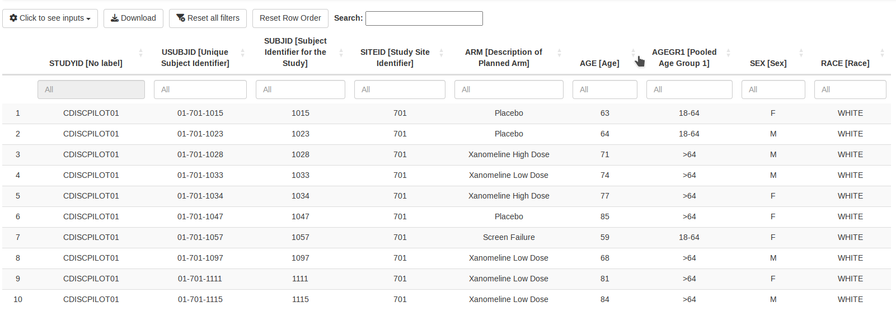

# dv.listings

The listings module from DaVinci's {dv.listings} package displays arbitrary datasets as listings. 
Users can select the dataset to be shown, and specify
which columns of the dataset should be displayed as well as their order.
The displayed columns can be sorted and filtered. Moreover, the
listing can be filtered to show only entries containing a keyword specified by the user. 
The module is not limited to usage of one data source,
most notably, it can handle data from ADaM or SDTM.



The module is prepared to be used in combination with DaVinci's {dv.manager} package and
supports its bookmarking functionality.

## Installation

Feel free to copy the following code chunk to install the latest version of {dv.listings}.

``` r
if (!require("remotes")) install.packages("remotes")
remotes::install_github("Boehringer-Ingelheim/dv.listings")
```

Since the listings module is intended to be used within an application
created by means of DaVinci's module manager, make sure that you
have installed {dv.manager} with a version number equally to or higher than 2.1.0.

## Data requirements

As stated above, the listings module can display data from various data sources.
However, for the column filters to function correctly, 
columns need to be converted to the appropriate data
types, e.g., categorical data should be stored as factor, numbers as
numeric, etc. To simplify data conversion, 
the package provides a convenient function called
`convert_data()`. An example demonstrating the usage of this function can be found
in the section below.

Note that `dv.listings` drops row names. In case your dataset is equipped
with informative row names that are required to be displayed, you have
to include them manually in the scope of preprocessing. For example:

``` r
my_data <- datasets::mtcars
my_data[["index"]] <- rownames(my_data)
attributes(my_data$index)$label <- "Former row names"
```

## Example

To define an app based on {dv.listings} and {dv.manager}, you need to

1.  load data,
2.  make sure that the provided data comply with the requirements of the listings module,
3.  define a list of modules that contains the listings module,
4.  and launch the app via `run_app()` from {dv.manager}.

The following example contains the listed steps. For data protection
purposes, the example uses dummy data from {pharmaverseadam}.

``` r
library(dv.listings)

# 1. Create a data list with example data
data_list <- list(
  adsl  = pharmaverseadam::adsl,
  adae  = pharmaverseadam::adae,
  adtte = pharmaverseadam::adtte_onco
)

# 2. Preprocessing
# Convert data to appropriate types
data_list$adsl <- convert_data(data_list$adsl)
data_list$adae <- convert_data(data_list$adae)
data_list$adtte <- convert_data(data_list$adtte)

# Assign meaningful labels to data domain names
attributes(data_list$adsl)$label <- "Subject Level"
attributes(data_list$adae)$label <- "Adverse Events"
attributes(data_list$adtte)$label <- "Time-to-Event"

# Specify default variables
default_vars <- list(
  adsl = c("STUDYID", "USUBJID", "SITEID", "ARM"),
  adae = c("STUDYID", "ASTDY", "AENDT", "AESER")
)

# 3. Module list
module_list <- list(
  "Exemplary Table" = mod_listings(
    module_id = "mod1",
    dataset_names = c("adsl", "adae", "adtte"),
    default_vars = default_vars
  )
)

# 4. Launch the app
dv.manager::run_app(
  data = list("MyData" = data_list),
  module_list = module_list,
  filter_data = "adsl"
)
```
## Export functionality 

The listings module allows users to export listings. Users have the option to either download only the currently displayed listing or all available listings.

To download the currently active listing, it will be saved exactly as it appears on the screen, either in .xlsx or .pdf format. In case any filters have been applied, the downloaded file will reflect these and only include the filtered data.

For users who wish to download all listings, the module allows saving in .xlsx format exclusively. This process disregards any local filters, and each listing is saved in a separate worksheet within the file. 

Please be aware that the PDF download feature is implemented using an RMarkdown file that is rendered into a PDF through LaTeX. As such, it is important to note that a LaTeX installation, along with the necessary packages, is required to use this feature.

## Jumping Feature

When this feature is enabled, users can click on the subject identifier column to drill down on details related to a specific subject. To see a working example, please refer to the "Communication_jumping_feature" vignette.
