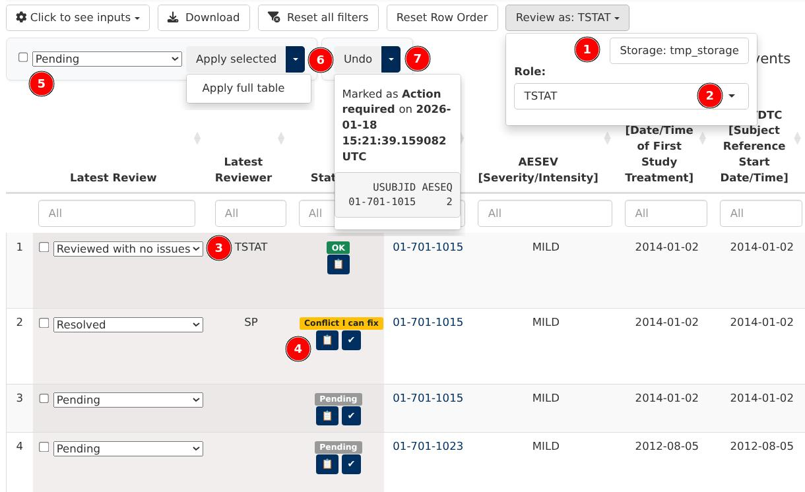

```{r, include = FALSE}
knitr::opts_chunk$set(
  collapse = TRUE,
  comment = "#>"
)
```

## Introduction

The `dv.listings` module provides an optional user interface to assist data review processes. It enables a team of reviewers to annotate each row of a given listing with a tag chosen from a preconfigured list of options. In addition, it keeps track of changes to the data underlying the listings to warn about possibly outdated reviews.

Here's a more detailed description of the review function:

- Users can self-select a reviewer role and, under that capacity, annotate each row of any given dataset with a value chosen from those available on a dropdown menu.
- Several users can interact under _strictly non-overlapping_ roles with the application, each annotating individual rows of _possibly overlapping_ datasets.
- All decisions, including conflicting ones (i.e., those differing across roles), are stored. The last decision is the one visible to all users by default.
- Rows are identified by a subset of the dataset's columns (which we call `identifier` columns). That subset is dataset-specific. No two rows can share the same set of identifier values.
- A subset of the columns (which we call `tracked` and does not overlap the `identifier` columns) is considered necessary and sufficient for review purposes.
- Updates to the provided datasets are expected during the course of a study. 
- Changes to contents of `tracked` columns of a previously reviewed dataset row will be highlighted in the user interface and require re-confirmation.
- All datasets share the same decision dropdown choices.

## User interface

When properly configured, the interface of the module expands with two extra components, as pictured below:

- A drop-down menu (top-right corner), that allows users to select:
  1. A location to store information derived from the review process.
  2. A reviewer role under which actions will be registered.
- Additional columns to the left of the listing (bottom-left corner) to perform point-and-click reviews:
  3. The "latest review" column shows the most recent review provided by a member of the team and allows to change it.
  4. The "status" column displays possible review disagreements among the team and allows to investigate and resolve them.



These three review columns behave similarly to the regular listing columns, as they allow filtering and sorting. Thus, they make it easy to find which reviews are pending or to list reviews that conflict across reviewers.

## Module configuration

The review feature is configured through the optional `review` parameter of `mod_listings`. Below is an example configuration for two hypothetical demographics (`dm`) and adverse events (`ae`) SDTM domains:
```
mod_listings(
  ..., # all other parameters omitted for brevity
  dataset_names = c("ae", "dm"),
  review = list(
    datasets = list(
      dm = list(
        id_vars = "USUBJID",
        tracked_vars = c("RFSTDTC", "RFENDTC")
      ),
      ae = list(
        id_vars = c("USUBJID", "AESEQ"), 
        tracked_vars = c(
          "AETERM", "AEDECOD", "AESEV", "AESTDTC", 
          "AEENDTC", "AEOUT", "AEACN", "AEREL"
        )
      )
    ),
    choices = c("Pending", "Action required", "Reviewed"),
    roles = c("TSTAT", "SP", "Safety", "CTL"),
    store_path = NULL
  )
)
```
The `review` parameter is itself divided into four subfields:

- `datasets`: A named list of domain configurations. The names refer to datasets with associated listings, i.e. those provided through the `dataset_names` parameter. Each of the elements in that list is itself a list with two elements:

  - `id_vars`: `[character(n)]` Immutable variables that uniquely identify each record for a given domain. For example, in the case of the demographics domain, the **U**nique **SUBJ**ect **ID**entifier is enough. In the case of the adverse events domain, both USUBJID and the **A**dverse **E**vent **SEQ**uence number are necessary.
  - `tracked_vars`: `[character(n)]` Variables to track across dataset updates. If the contents of one of this columns changes on an already reviewed row, that review will be marked as potentially outdated.
- `choices`: `[character(n)]` Review choices available to assign to each listing row.
- `roles`: `[character(n)]` Names of reviewer roles.
- `store_path`: `[character(1)]` Optional. If specified, files associated to the review process will be stored on this path on the server. If left unspecified, those files will be stored on a folder of the _client_'s computer. The users of the app will have the opportunity to choose the path when they launch it.

## Storage of review-related files

The review of datasets that evolve over the course of a clinical trial requires some form of storage that is:

- Shared among the members of the team conducting the review.
- Stable throughout the duration of the trial.

The natural location for this storage would be on a folder of the server that hosts the review application. However, some Shiny execution environments lack permanent server storage. In such cases, the module offers the possibility of storing review information on the client side if the `store_path` field of the `review` parameter is left unspecified. 

#### Client side storage

Recent versions of Google Chrome and browsers derived from it (Edge, etc.) offer experimental support for javascript code to read and write to the client file system as native apps do. This module takes advantage of this [File System Access API](https://wicg.github.io/file-system-access/) to compensate for the lack of server storage.

In practical terms, relying on this feature means that every time users access a review app, their browser will prompt them to ask for permission to read and write to a folder allocated specifically for review purposes.

In the case of reviews conducted by a team of reviewers, the team as a whole will have to decide beforehand on which networked folder (shared through NFS, Google Drive, Microsoft OneDrive, Dropbox, ...) to use in order to collaborate for the duration of the study.

## Data Stability Requirements
The module only has access to the latest version of any given dataset. In order to inform users about modified and newly added records, it relies on stored summary hashes of previously seen data. Thus, it's necessary that some aspects of the representation of data are kept constant over the life of a study. These are:

- All rows of each provided dataset are identified uniquely by the combination of `id_vars` configured at the beginning of the study.
- Identifying variables (defined through `id_vars`) and tracked variables (defined through `tracked_vars`) have to remain the same for the duration of the study.
- Identifying and tracked variables retain their types (factor, numeric, ...) and are available on each revision of each dataset.
- No data rows are dropped during the study. In other words, if a row identified by a combination of `id_vars` is present on revision `n` of a dataset, it will be available on revision `n+1`.

## Implementation details

This final section documents the design principles and the structure of the review-related files that `dv.listings` creates. It can be safely skipped for regular use of the review feature. However it may prove useful in the following scenarios:

- For future `dv.listings` developers/maintainers, to know the reasoning behind some unusual design decisions.
- For app creators and users, to know how to backup and migrate review data.
- For app users, to know how to read and explore review data outside the limitations of the module.

The file formats used for the review portion of `dv.listings` are still a work in progress, but our goal is to document them thoroughly enough for external tools to parse them or even produce them. This should allow third-parties to address specific user needs without cluttering the `dv.listings` module with infrequently used (but still useful) functionality.

<details><summary>**Storage design considerations**</summary>
The nature of the review feature requires concurrent multi-user (multi-session, multi-process) write access to a shared resource, which Posit deems incompatible with pins (https://docs.posit.co/connect/user/pins/, see reddish box).

This is the first DaVinci module that will serialize to permanent storage a substantial amount of study decisions taken over an extended period of time. Loss of data in this context is not acceptable. To guarantee data integrity, we propose the use of simple *append-only* data structures. Put simply, they are plain files opened in "append" mode. It's easy to demonstrate that they can't become the source of catastrophic loss of data of past review sessions. The granularity of the `pins` API (which only allows to load and store complete files) is incompatible with this design. 

Data appending improves performance, as only new changes need to be serialized. It's also useful for version tracking, as all editing operations can be replayed in the order in which they happened.

Backing up review data can be accomplished by copying the contents of the container folder to an independent file system. Since all review operations are appended, a delta-transmission tool such as `rsync` is a natural fit.

Lastly, using plain file storage allows for easy local testing and for universal use of the review feature (running the application locally, on Connect, on Openshift, ...).

</details>

<details><summary>**Structure of stored files**</summary>

If we take a hypothetical "xyz" domain, `dv.listings` will store the following files for review purposes (expand to see the layout of their contents):

<details><summary>`xyz_000.base` (information related to the first version of the "xyz" domain dataset seen by the module)</summary>
- 1 file magic code ("LISTBASE")
- 1 format version number (0)
- 1 generation marker (0)
- 1 timestamp of creation date+time (UTC)
- 1 complete hash of the "xyz" data.frame
- 1 domain string ("xyz")
- n `id_vars` variable names
- n `id_vars` variable types (see "Variable type encoding" below)
- m `tracked_vars` variable names
- m `tracked_vars` variable types (see "Variable type encoding" below)
- 1 row count
- p (1 per "xyz" row) `hash_id(xyz[id_vars])`
- p (1 per "xyz" row, *m* bytes long) `hash_tracked(xyz[tracked_vars])`
</details>

<details><summary>`xyz_001.delta` (one per domain dataset update)</summary>
- 1 file magic code ("LISTDELT")
- 1 format version number (0)
- 1 generation marker (1)
- 1 timestamp delta (seconds elapsed since "base" timestamp)
- 1 complete hash of new "xyz" data.frame
- 1 domain string ("xyz")
- 1 count of new rows
- n (1 per *new* "xyz" row) `hash_id(xyz[id_vars])`
- n (1 per *new* "xyz" row, *m* bytes long) `hash_tracked(xyz[tracked_vars])`
- 1 count of modified rows
- p (1 per *modified* "xyz" row) row index
- p (1 per *modified* "xyz" row, *m* bytes long) `hash_tracked(xyz[tracked_vars])`
</details>

<details><summary>`xyz_<ROLE>.review` (one per domain and ROLE)</summary>
- 1 file magic code ("LISTREVI")
- 1 format version number (0)
- 1 role string
- 1 domain string ("xyz")
- n reviews: row index + `review_index` + delta timestamp
</details>

<details><summary>`review.codes` (one per app):</summary>
- 1 file magic code ("LISTCODE")
- 1 format version number (0)
- n review texts
</details>

(Row indices refer to indices in the stored base+delta matrix, which is append-only. These _canonical_ indices are as good as identifiers).

The dominant factor governing the size of these files is the length of a hash, which is 16 bytes, as we discuss in the "Hashing" session below. Row indices and delta timestamps can be encoded in 4 bytes. Review indices take up 1 byte each. Estimating an upper bound of 1 million rows per dataset, a `.base` file would take around 32 MiB. A comprehensive `.review` file for such a dataset would take around 9 MiB.

These file structures are designed so that they start with a short heterogeneous header that reiterates the information that can be gleaned from the file name. The rest of the records are all homogeneous and of known size. That allows to load them into memory without the need for expensive parsing.

These files won't benefit much from compression since their main content (the hashes) is by construction statistically indistinguishable from noise.

</details>

<details><summary>**Variable type encoding**</summary>
The two "variable type" `.base` fields are encoded as single bytes that take the following values:

- Date: 1
- POSIXct: 2
- POSIXlt: 3
- Logical: 10
- Factor: 11
- Integer: 13
- Numeric: 14
- Complex: 15
- Character: 16
- Raw: 24

Most of these values are taken from the base R `SEXPTYPE` enum definition (see `src/include/Rinternals.h` on any recent R source distribution). 

The values assigned to time types are arbitrary, because they are S3 objects and thus lack dedicated `SEXPTYPE` values.

The type of a `factor()` variable is not fully defined by it being tagged as such, since the levels and their internal encoding is also part of the type. For purposes of hashing, the review feature of `dv.listings` treats the content of factor columns as `character()` by mapping their value to their assign string-like representation. This feature also is indifferent to a factor being ordered.
</details>

<details><summary>**Hashing strategy**</summary>
We store hashes for the values of `id_vars` and `tracked_vars` dataset columns. These hashes serve as content IDs.

#### Choice of hash function

A popular choice for non-cryptographic hashing is the `xxh` family of function (https://github.com/Cyan4973/xxHash/tree/dev?tab=readme-ov-file#xxhash---extremely-fast-hash-algorithm) for its balance of speed and perceived hash quality.
Three independent R packages implement them:

- rlang: Provides no control over serialization, so hashes are potentially not stable across R versions. 
- digest: Maintained by Dirk Eddelbuettel, known for being a stickler for backwards compatibility. Provides serialization options.
- xxhashlite: Substantially faster than the other two implementations for small input sizes (our scenario). Provides serialization options.

It makes sense to use the fastest implementation available, as it respects the time of users and requires less energy. `xxhashlite` is then the clear winner, but migration to `digest` (or "vendoring" of `xxhashlite` inside this package) is always possible if this lesser-known package is somehow retired from CRAN.

#### Hashing of ID variables (`hash_id()`)

With a perfect hash function, we would expect a collision after `2^(n/2)` entries have been hashed, where `n` is the output length in bits of the chosen hash. A hash that produces 64 bits is not strong enough as 2^32 is a large quantity of hashes, but still bound to collide if the review feature is used long enough.

We opt instead for 128 bits, which makes the possibility of a collision extremely unlikely. We expect an upper bound of one million rows per dataset, which is 13 *orders of magnitude* lower than the mean amount of entries estimated necessary to get a collision. The chosen hash won't be perfect, but we have an ample safety margin. We also assume that data has not been created through adversarial means geared towards making hash collisions more likely.

#### Hashing of tracked variables (`hash_tracked()`)
We could apply the same reasoning behind the choice of the `hash_id()` function to the hashing of the variable parts of each row. We instead propose a more complex hashing scheme to provide partial information about *which variables of a row have been altered* when its hash changes.

Each hash value is *m* bytes long, where *m* is the number of variables tracked of a given dataset. Each of those bytes is an independent hash of three of the tracked variables of a dataset row. Each variable, in turn, contributes to three of the *m* byte-sized hashes. This mixing of variables makes it harder for an external adversarial observer of the `.base` and `.delta` files to brute-force the original values of the dataset by looking for collisions with the computed hash values.

To compute which variables contribute to which hash byte, we use the following scheme:

  - Byte *n*: Variables (*n*+0)%*n*, (*n*+2)%*n* and (*n*+3)%*n*

Where `%` indicates the remainder of the integer division.

So, for a input dataset with seven tracked variables (zero through six), this would mean:

  - Byte 0: Variables 0, 2 and 3
  - Byte 1: Variables 1, 3 and 4
  - Byte 2: Variables 2, 4 and 5
  - Byte 3: Variables 3, 5 and 6
  - Byte 4: Variables 4, 6 and 0
  - Byte 5: Variables 5, 0 and 1
  - Byte 6: Variables 6, 1 and 2

This scheme creates a unique mixtures of variables. Take, for instance, variable 0. It is combined with variables 2 and 3 on the zeroth byte, with variables 4 and 6 on the fourth byte and with 1 and 5 for the fifth byte.

Each of these bytes is computed by:

- Taking the three values to hash.
- Serializing them to text and concatenating them using the non-ASCII byte separator `1D` (also known as "group separator").
- Computing the `xxh32` hash and returning its most significant byte.

Informal testing (refer to `tests/testthat/tests-hash_tracked.R` for more details) of this hashing scheme shows the following properties:

- It's capable of identifying up to four modified variables per row (after that, it's preferable to give up and notify the whole row as modified).
- It has a very low **false negative rate** (a variable is modified without it being notified as such) of one for every 16 million row updates.
- It has a low **false positive rate** (a variable that retains its value is notified as modified). This only happens when there are actual changes to a row.

False positives are not critical, as they ask reviewers to consider a larger set of variables when re-reviewing a row that has been altered.

False negatives *are* critical, since they allow changes to go unreported to reviewers. This is why our choice of hash favors false positives over false negatives.

This composite hash function is a compromise found through heuristic exploration. If we come up with a better option, we can version it through the "format version number" present in `.base` and `.delta` files. This means that neither app creator nor app users have to concern themselves about the underlying `hash_tracked` representation.

</details>
